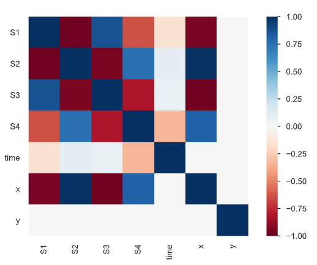
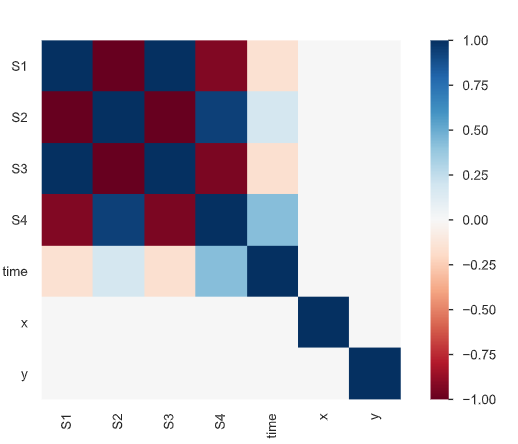

<script type="text/javascript" src="http://cdn.mathjax.org/mathjax/latest/MathJax.js?config=TeX-AMS-MML_HTMLorMML"></script>
<script type="text/x-mathjax-config">
  MathJax.Hub.Config({ tex2jax: {inlineMath: [['$','$'], ['\\(','\\)']]} });
</script>
# 🧬 **Predictioneer – AZeotropy ’26**

## *Inferring a Gene Regulatory Network from Spatial Expression Dynamics*


### **Team:** Vision Grow Globally
### **Members:** Akshat Sandpa, Bhumitsinh Rana
---

## 📘 1. Introduction

Biological tissues often rely on spatial chemical signals, known as **morphogens**, to regulate gene expression patterns. These morphogens interact with intracellular gene networks, forming complex regulatory systems that evolve over space and time.

In this project, the objective is to **infer an unknown Gene Regulatory Network (GRN)** using spatial–temporal gene expression data obtained after controlled perturbation experiments.

**The System Architecture:**
* **2 Morphogens:** $(M_1, M_2)$ — *External chemical signals.*
* **4 Genes:** $(S_1, S_2, S_3, S_4)$ — *Intracellular state variables.*
* **Domain:** A 2D spatial tissue grid with multiple time observations.

---

## 🎯 2. Objectives

The main goals of this study are:

1.  **Infer Gene–Gene Interactions**
    → Identify which genes promote or inhibit others (Matrix $A$).
2.  **Estimate Morphogen–Gene Coupling**
    → Determine the direct effect of morphogens on gene expression (Matrix $B$).
3.  **Predict Unseen Dynamics**
    → Simulate gene expression after removing morphogen $M_1$ (Experiment B).

---

## 🔬 3. Data Exploration & Audit

Before mathematical modeling, a thorough audit of the dataset `GRN_experiment_M2_removal.csv` was conducted to understand the physical constraints of the simulation.

### **Dataset Characteristics**
* **Dimensions:** $(6171, 7)$ — The dataset is lightweight (~337 KB), allowing for full-batch processing in memory without batching.
* **Data Types:** All columns are `float64` (Continuous numerical data).
* **Integrity:** `df.isnull().sum()` confirmed **zero missing values** and `df.duplicated().sum()` confirmed **zero duplicate rows**.

### **Statistical Insights**
Using statistical descriptions and correlation matrices, we derived the following biological intuitions:

> **💡 Key Insight: The Correlation Topology**
>
> A preliminary correlation analysis (`df.corr()`) revealed a distinct network topology:
> * $S_1$ and $S_3$ share a **high positive correlation**.
> * $S_2$ and $S_4$ share a **high positive correlation**.
> * The $(S_1, S_3)$ pair has a **strong negative correlation** with the $(S_2, S_4)$ pair.
>
> This suggests an antagonistic relationship between these two gene groups, hinting at the structure of Matrix $A$ before training.

---

## 🧠 4. Mathematical Formulation

Gene expression dynamics are modeled as a linear dynamical system:

$$
\frac{dS_i}{dt} = -\alpha_i S_i + \sum_{j=1}^{4} A_{ij} S_j + \sum_{k=1}^{2} B_{ik} M_k
$$

### Term Interpretation

| Term | Description |
| :--- | :--- |
| $S_i$ | Deviation of gene *i* from baseline concentration. |
| $-\alpha_i S_i$ | **Auto-regulation** (Decay/Restoration to baseline). |
| $A_{ij}$ | **Gene–Gene Regulation** (Activation/Inhibition). |
| $B_{ik}$ | **Morphogen–Gene Coupling** (External Control). |

---

## 🛠 5. Methodology

### Step 1 — Morphogen Reconstruction
Since $M_1$ is a spatial gradient dependent only on $x$, we reconstructed it analytically.

$$
M_1(x,y) = e^{-2.5x}
$$

*(Note: Morphogen $M_2$ was removed in this specific experiment, so we train on $M_1$ effects only.)*

### Step 2 — Temporal Derivative Approximation
To find the rate of change in gene expression ($\frac{dS}{dt}$), we utilized a **Finite Difference Method** based on the time step $\Delta t = 0.08$ sec.

$$
\frac{dS_i}{dt} \approx \frac{S_i(t) - S_i(t-1)}{\Delta t}
$$

* **Handling Boundary Conditions:** At $t=0$, there is no previous value. These `NaN` rows were dropped to ensure regression stability.

### Step 3 — System Identification via Linear Regression
We reframed the differential equation as a linear regression problem: $Y = WX$.

* **Target ($Y$):** The calculated rate of change $\frac{dS_i}{dt}$.
* **Features ($X$):** The current states $[S_1, S_2, S_3, S_4, M_1]$.
* **Assumption:** We set `fit_intercept=False`.
    * *Reasoning:* The system describes deviations from a baseline. If all concentrations ($S$) and inputs ($M$) are zero, the change rate should be zero. Therefore, the line must pass through the origin.

---

## 🎚 6. Thresholding & Network Logic

After obtaining raw coefficients from the regression, we applied a discretization step to convert continuous weights into network edges $(+1, -1, 0)$.

### **The Threshold Selection Strategy**
Initially, a standard threshold of **0.2** was proposed to separate signal from numerical noise. However, a deeper inspection of the raw coefficients revealed a critical edge case:

> **⚠️ Critical Adjustment**
>
> The interaction coefficient for $M_1 \to S_3$ (in Matrix B) was calculated to be approximately **0.195**.
>
> * **Noise Level:** $< 0.05$
> * **Dominant Interactions:** $> 0.4$
> * **The 0.195 Case:** This value was significantly higher than the noise floor. Using a strict 0.2 threshold would have erased this valid biological interaction.
>
> **Decision:** The threshold was fine-tuned to **0.18** to capture this interaction while effectively filtering out noise.

### **Deriving Matrix B (Morphogens)**
The regression provided the effects of $M_1$. However, we needed the effects of $M_2$ for the final prediction.

> **💡 Physical Constraint: Steady State Balance**
>
> We assumed that at the steady state (baseline), the morphogens counteract each other to maintain equilibrium. Therefore, the effect of $M_2$ is equal and opposite to $M_1$.
>
> $$B_{i,2} = -B_{i,1}$$

---

## 📊 7. Inferred Network Structure

### Gene Regulatory Matrix ($A$)
*Describes how genes interact with one another.*

$$
A = \begin{bmatrix}
0 & +1 & 0 & 0 \\\\
-1 & 0 & +1 & 0 \\\\
0 & -1 & 0 & +1 \\\\
0 & 0 & -1 & 0
\end{bmatrix}
$$

### Morphogen Coupling Matrix ($B$)
*Describes how external signals drive the system.*

$$
B = \begin{bmatrix}
+1 & -1 \\\\
-1 & +1 \\\\
+1 & -1 \\\\
0 & 0
\end{bmatrix}
$$

---

## 🚀 8. Prediction Task — Experiment B

We simulated **Experiment B**, where $M_1$ is removed and only $M_2$ remains active. This required a numerical solver to step through time.

### **Simulation Parameters**
* **Method:** Euler Integration (First-Order).
* **Alpha ($\alpha$):** 1.02 (Derived from the diagonal of the regression weights).
* **Morphogen $M_2$:** Modeled as a Gaussian peak centered at $(0.5, 0.5)$.

$$
M_2(x,y) = \exp\left(-\frac{(x-0.5)^2 + (y-0.5)^2}{2(0.18)^2}\right)
$$

### **The Code Implementation**

We initialized the state $S(t=0) = 0$ and iteratively updated the system using the derived matrices $A$ and $B$.

```python
# Setup: Times and Grid
times = np.sort(df_template['time'].unique())
dt = times[1] - times[0]
unique_coords = df_template[['x', 'y']].drop_duplicates().values

# Initial State: t=0 and S=0 (Steady State)
S_state = np.zeros((len(unique_coords), 4))
M2_vals = np.exp(-((unique_coords[:, 0] - 0.5)**2 + (unique_coords[:, 1] - 0.5)**2) / (2 * (0.18)**2))
B2 = B[:, 1] # Extracting the M2 column from Matrix B

results_storage = {}

# Euler Integration Loop
for t in times:
    # 1. Store current state mapped to (time, x, y)
    for i, (x, y) in enumerate(unique_coords):
        results_storage[(round(t, 4), round(x, 4), round(y, 4))] = S_state[i].copy()
    
    # 2. Calculate Derivative (Rate of Change)
    # dS/dt = -Alpha*S + (Gene Interactions A) + (Morphogen Input B)
    dS_dt = -alpha * S_state + (S_state @ A.T) + np.outer(M2_vals, B2)
    
    # 3. Update State for next timestep
    S_state += dS_dt * dt
```
## 📤 9. Conclusion & Submission
By combining **statistical auditing**, **linear system identification**, and **logical biological constraints (steady-state balancing)**, we successfully inferred the underlying network topology.

The final prediction results were re-ordered to match the submission template and exported to **CSV** with high precision.

## 📉 10. Validation via Correlation Analysis

To ensure the biological plausibility of our prediction, we performed a **post-simulation audit** by comparing the correlation heatmaps of the input training data (Experiment A) and the predicted output (Experiment B).

### **Visual Comparison**

<p align="center">
  <table>
    <tr>
      <td align="center"><b>Input Data (Experiment A)</b><br><i>Driven by M1 Gradient</i></td>
      <td align="center"><b>Predicted Output (Experiment B)</b><br><i>Driven by M2 Spot</i></td>
    </tr>
    <tr>
      <td></td>
      <td></td>
    </tr>
  </table>
</p>

### **Observation 1: Network Topology vs. Signal Direction**
The internal correlation structure between genes $(S_1, S_2, S_3, S_4)$ remained **identical** between the input and output datasets.

* **The Paradox:** Since $M_1$ and $M_2$ have opposite effects, one might expect the heatmap colors to invert.
* **The Resolution:** Correlation measures **relationships**, not absolute direction. Even though the genes are moving in opposite directions under the new morphogen, their relationship (e.g., Gene $S_1$ and Gene $S_2$ being "enemies") remains constant.
* **Conclusion:** The persistence of the correlation pattern proves that the **gene regulatory logic (Matrix A)** was preserved correctly.

### **Observation 2: The "Disappearing Gradient" Proof**
A critical difference was observed in the spatial correlations, confirming the successful removal of $M_1$:

| Feature | Input Data (Exp A) | Predicted Output (Exp B) | Interpretation |
| :--- | :--- | :--- | :--- |
| **Correlation w/ $x$** | **High** (Strong Color) | **Zero** (White/Neutral) | **SUCCESS** |

* **Reasoning:** In the Input, gene expression followed the linear gradient of $M_1$ ($e^{-2.5x}$), creating a strong correlation with $x$. In the Output, the genes decoupled from $x$ and instead followed the Gaussian geometry of $M_2$.
* **Verdict:** The simulation successfully transitioned the system from a gradient-driven state to a spot-driven state.